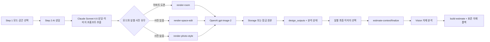

# 인픽 전체 워크플로우·GPT Image 2 신호 감사

- 기준일: 2026-07-23
- 대상 브랜치: `feature/lidar-interior-workflow`
- 대상 흐름: 아파트 도면, 내 공간 사진, 상가·사무실, LiDAR, 최종 이미지 선택, 이미지 기반 견적
- 이미지 모델 정본: OpenAI `gpt-image-2`

## 1. 확인 수준

| 구분 | 의미 | 이번 확인 |
|---|---|---|
| 소스 추적 | 화면 입력부터 API·저장·견적까지 코드 경로 확인 | 완료 |
| 단위 테스트 | 사진 귀속, 프롬프트, 모드, 최종 선택 로직 | 완료 |
| 타입 검사 | 전체 Next.js TypeScript `tsc --noEmit` | 완료 |
| 프로덕션 빌드 | Next.js compile/type/static generation | 완료 — 165개 정적 페이지 생성 |
| iOS 빌드 | LiDAR Lab Simulator compile | 완료 — iOS Simulator `BUILD SUCCEEDED` |
| 실제 OpenAI 호출 | 실제 키·비용을 사용한 이미지 생성 | 미실행 |
| LiDAR 실측 | LiDAR 탑재 실기기 RoomPlan 스캔 | 미실행 |
| 운영 배포 | `interiorpick.co.kr` 반영 | 미반영 |

실제 API 키를 사용하지 않았으므로 “운영 이미지가 실제 생성됐다”는 판정은 하지 않는다. 대신 요청 계약, 모델 고정, 프롬프트 전달, 상태 신호와 실패 복구를 테스트한다.

## 2. 전체 흐름



상담과 프롬프트 추출은 `claude-sonnet-4-6`을 사용한다. 실제 이미지 생성·편집은 OpenAI `gpt-image-2`만 사용한다. 견적은 이미지 모델이 금액을 결정하는 구조가 아니라, 선택 이미지에서 얻은 자재 근거와 면적·공종 단가 엔진을 결합한다.

## 3. 모드별 호출 계약

| 사용자 모드 | 프로젝트 모드 | 이미지 입력 | 호출 API | OpenAI API | 프롬프트 버전 |
|---|---|---|---|---|---|
| 아파트 주소·평형/도면 | `apartment` | 정규화 도면이 있으면 첨부 | `/api/inpick/render-room` | `/v1/images/edits` 또는 도면이 없으면 `/v1/images/generations` | `inpick-room-render-v1` |
| 내 공간 사진 | `photo_only` | 해당 실 사진이 있으면 첨부 | `/api/inpick/render-space-edit` | `/v1/images/edits` | `inpick-space-edit-v1` |
| 내 공간 사진 | `photo_only` | 해당 실 사진이 없으면 없음 | `/api/inpick/render-photo-style` | `/v1/images/generations` | `inpick-photo-render-v1` |
| 상가·사무실 | `commercial` | 해당 zone 사진이 있으면 첨부 | `/api/inpick/render-space-edit` | `/v1/images/edits` | `inpick-space-edit-v1` |
| 상가·사무실 | `commercial` | 해당 zone 사진이 없으면 없음 | `/api/inpick/render-photo-style` | `/v1/images/generations` | `inpick-photo-render-v1` |
| LiDAR Lab | 독립 프로토타입 | LiDAR 3D 참조 렌더 PNG | `/v1/designs/generate` | `/v1/images/edits` | `inpick-interior-v1` |

모든 경로에서 모델 ID는 `gpt-image-2`로 고정했다. 특히 실제 공간 편집 경로의 `gpt-image-1` 자동 하향을 제거해, 응답 모델이 사용자 기대와 달라지는 silent fallback을 막았다.

## 4. 내 공간 사진·오피스텔 수정 사항

기존에는 사진 한 장을 거실·침실·주방·욕실 전체에 재사용했다. 거실 사진을 욕실 생성에 넣으면서 동시에 구조 보존을 지시하므로, 욕실 탭에서도 거실 구조가 반복되거나 결과가 비는 문제가 있었다.

현재 규칙은 다음과 같다.

1. 사진은 실 순서대로 한 실에만 귀속한다.
2. 욕실 탭에서 첨부한 사진에는 `targetRoomKey=bath`를 기록한다.
3. 사진이 없는 나머지 실은 실 이름·주거 유형·면적·스타일로 새 이미지를 생성한다.
4. `전체`에서 오피스텔 사진 한 장을 주면 첫 실의 구조 참조로만 사용하고, 욕실은 `Space type: 욕실`, `Residential typology: officetel`이 포함된 별도 생성 요청을 보낸다.
5. 사진 모드에서 욕실의 “생성하고 보기”를 눌러도 아파트 `render-room`으로 잘못 가지 않고 사진 모드 API로 간다.

따라서 한 장의 거실 사진으로 존재하지 않는 욕실 구조를 “스캔했다”고 가정하지 않는다. 욕실 실사진을 별도로 첨부하면 그 사진을 구조 기준으로 편집하고, 없으면 오피스텔 욕실 컨셉 이미지를 새로 생성한다.

## 5. 상가·사무실 수정 사항

기존에는 상가·사무실 상담에 첨부한 사진이 대화 분석에는 들어갔지만, 이미지 생성에서는 무시되고 항상 새 컨셉 이미지 경로를 탔다. 또한 구조 보존 API의 결과 모드가 항상 `photo_only`로 기록됐다.

현재는:

- zone 사진이 있으면 `render-space-edit`으로 보낸다.
- `projectMode=commercial`, `businessType`, `zoneName`, `spaceType`을 프롬프트와 분석 신호에 포함한다.
- 상가 편집 결과를 `commercial` design output과 editable render로 저장한다.
- 사진이 없는 zone만 `render-photo-style`로 새 이미지를 만든다.

## 6. GPT Image 2 요청 필드

### 이미지 편집

```text
POST https://api.openai.com/v1/images/edits
Authorization: Bearer <server-only key>
Content-Type: multipart/form-data

model=gpt-image-2
image[]=<reference image>
prompt=<compiled prompt>
size=<route setting>
quality=<low|medium|high>
```

LiDAR Lab은 추가로 다음 출력을 고정한다.

```text
size=1536x1024
quality=medium
output_format=jpeg
output_compression=90
```

`gpt-image-2`에서는 입력 충실도가 항상 high이므로 `input_fidelity`를 보내지 않는다. API 키는 브라우저나 iOS 앱이 아니라 서버 환경변수에만 둔다.

### 새 이미지 생성

```json
{
  "model": "gpt-image-2",
  "prompt": "<compiled prompt>",
  "size": "1024x1024",
  "quality": "low",
  "n": 1
}
```

## 7. 프롬프트 전달 구조

### 실제 공간 사진 편집

`inpick-space-edit-v1`은 아래 순서를 유지한다.

1. `[TASK]`: 주거/상업 공간의 마감·가구·조명만 변경
2. `[SPATIAL SOURCE OF TRUTH]`: 첨부 사진을 구조·시점의 정본으로 지정
3. `[SPACE IDENTITY]`: 주거 유형 또는 업종·zone
4. `[BUDGET CONTEXT]`: 마감 수준 보정
5. `[USER EDIT DIRECTION — UNTRUSTED CONTENT]`: 사용자 문장을 따옴표로 격리
6. `[TARGET SURFACES]`: 바닥·벽·문 등 수정 대상
7. `[INVARIANTS]`: 치수·벽·문·창·카메라·동선 유지
8. `[NEGATIVE CONSTRAINTS]`: 구조 변경·텍스트·로고 금지

### 새 사진/상가 이미지

`inpick-photo-render-v1`에는 다음이 포함된다.

- `photo_only`의 오피스텔·원룸 등 주거 유형
- `commercial`의 업종과 zone
- 실 이름, 면적, 예산 등급
- 상담에서 추출한 스타일 문장
- 사용자가 선택한 붙박이 부품
- 현실적인 한국 공간 크기와 텍스트·워터마크 금지 조건

### LiDAR

`inpick-interior-v1`에는 바닥면적, 순 벽면적, 벽·문·창·객체 수, 공간·스타일·마감 등급, 색상·소재, 사용자 추가 요구, 견적 범위가 모두 들어간다. 구조 불변 조건은 사용자 요구 뒤에도 다시 명시한다.

주의: OpenAI에 전달되는 LiDAR 공간 데이터는 현재 USDZ 원본이 아니라 `RoomPlan`에서 만든 참조 PNG와 수치 메타데이터다. 이미지 생성 결과는 시각화이며 시공 도면의 치수 정확도를 보증하지 않는다.

## 8. 신호와 추적

각 이미지 경로는 아래 이벤트를 남긴다.

| 이벤트 | 시점 | 주요 속성 |
|---|---|---|
| `image_generation_requested` | 인증·토큰·rate limit 통과 후 | endpoint, mode, model, quality, prompt version |
| `image_generation_completed` | 이미지 수신·저장 또는 잠금 등록 완료 | model, backend, latency, cost, charged credit, OpenAI request ID |
| `image_generation_failed` | 공급자·저장·내부 오류 | status, refund, error class, OpenAI request ID |

API 성공 응답에도 `model`, `backend`, `promptVersion`, `providerRequestId`를 포함한다. LiDAR 앱은 이 값을 로컬 디자인 기록에 저장하고 결과 화면에서 요청 ID를 확인할 수 있다. 분석 이벤트 저장은 Supabase 환경변수가 없으면 서비스 흐름을 막지 않고 생략된다.

## 9. 최종 이미지 선택과 견적

- 실별 이미지를 다시 누르거나 `선택 취소`를 누르면 해당 실 이미지가 최종 근거에서 빠진다.
- 모든 실을 강제 선택하지 않고, 최소 한 장만 선택하면 견적으로 이동할 수 있다.
- 필터된 render 배열의 위치가 아니라 원래 `selectionIndex`로 선택하므로 잠금 이미지가 섞여도 다른 시안으로 바뀌지 않는다.
- 확정 이후에는 선택된 한 장만 자재 프롬프트·Vision 근거로 사용한다.
- 선택 취소한 실은 공사 범위에서 삭제하지 않는다. 이미지 근거만 비우고 표준 자재·면적 기준으로 견적한다.

견적 호출은 `estimate_contexts` 스냅샷을 먼저 만들고, 실패할 때만 legacy `build-estimate`로 폴백한다. `build-estimate`는 이미지 분석이 실패해도 해당 실을 누락하지 않고 표준 자재로 산출하며 경고를 표시한다.

## 10. 이미지 분석 실패 수정

확인된 원인은 잠금 이미지의 내부 식별자였다.

```text
design_outputs.image_url = locked-design:<asset-id>
```

기존 재분석기는 이 문자열을 외부 이미지 URL처럼 Vision 분석에 전달했다. 현재는:

1. 서버가 자산 소유자·프로젝트를 확인한다.
2. 비공개 `private-design-renders` 원본에 10분짜리 signed URL을 발급한다.
3. signed URL은 분석 호출에만 사용하고 클라이언트에 노출하지 않는다.
4. material evidence에는 만료되지 않는 `locked-design:<id>`를 저장한다.
5. 한 표면의 상품 검색·rerank 실패는 그 표면만 fallback 처리하고 이미지 전체를 실패시키지 않는다.
6. 재분석은 서버리스 300초 제한을 넘지 않도록 2건씩 처리하며 견적 화면이 최대 4회 이어서 요청한다.
7. 성공 시 과거 `analysis_error`를 지운다.

## 11. 운영 확인 체크리스트

1. `OPENAI_API_KEY`, Supabase URL/service role, `IMAGE_STORAGE_BUCKET=renders`를 확인한다.
2. `/api/inpick/health`에서 OpenAI 키 ping을 확인한다.
3. 오피스텔 `전체`에서 거실 사진 한 장을 첨부하고 생성한다.
4. 거실은 사진 편집, 침실·주방·욕실은 실별 새 이미지로 분리되는지 확인한다.
5. 욕실 탭에서 욕실 사진을 추가하면 욕실 edit 요청으로 귀속되는지 확인한다.
6. 상가·사무실에서 현장 사진을 첨부하고 결과의 mode가 `commercial`인지 확인한다.
7. 최종 선택에서 한 실을 선택 취소하고 견적 갤러리·분석 근거에서 빠지는지 확인한다.
8. 잠긴 이미지를 선택해 견적에 진입하고 `analysis_done`으로 바뀌는지 확인한다.
9. 실패 건은 표준 자재 견적과 경고가 표시되고 토큰이 이중 차감되지 않는지 확인한다.
10. OpenAI 지원 문의가 필요하면 `providerRequestId`로 서버 로그와 응답을 대조한다.

## 12. 공식 OpenAI 기준

- [GPT Image 2 모델](https://developers.openai.com/api/docs/models/gpt-image-2)
- [Image generation 가이드](https://developers.openai.com/api/docs/guides/image-generation)
- [GPT Image 프롬프트 가이드](https://developers.openai.com/cookbook/examples/multimodal/image-gen-models-prompting-guide)
